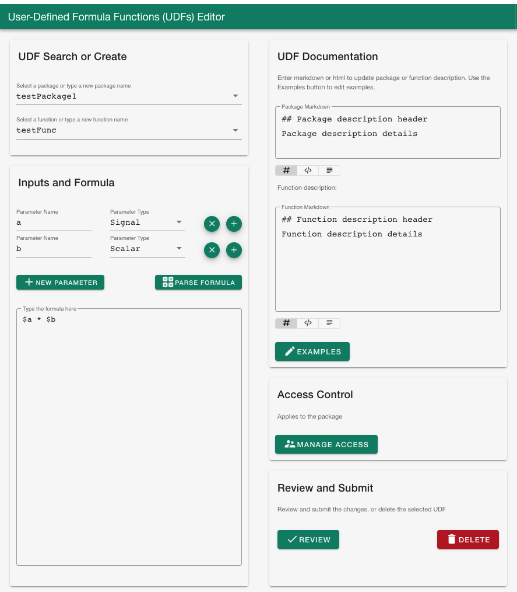

# Introduction

**seeq-udf-ui** is a Python module including a user interface, to manage and edit user-defined
formula functions (UDFs) in Seeq. UDFs already exist in Seeq and are formula functions with 
parameters that are not bound to any specific signals, and therefore, enable the user to scale
calculations across various assets. **seeq-udf-ui** makes creating and managing UDFs easier by
constructing the appropriate Seeq API calls and providing a UI so that the user doesn't need to be
familiar with the Seeq API or python sdk.

<table>
   <td>
      
   </td>
</table>
